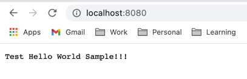

# Basic Golang WebServer
 This app is a practise code to test a basic web server in golang.
App will be a basic HTTP Server

App tries to implement [dependency-injection](https://www.tutorialsteacher.com/ioc/dependency-injection) using [go-uber-fx](https://pkg.go.dev/go.uber.org/fx) package. 

 
 Module will be updated as and when modified.